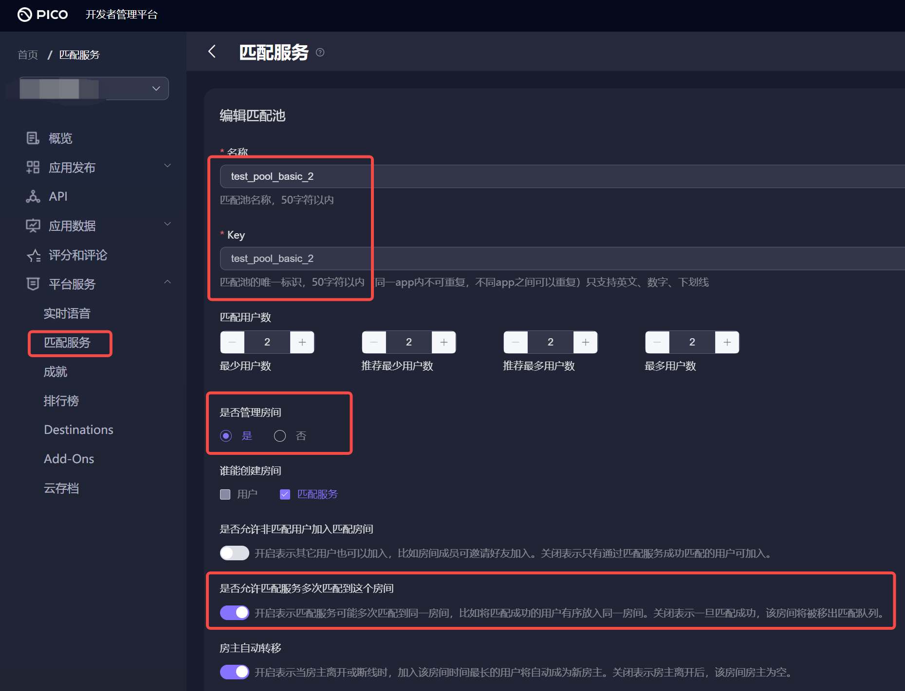

# PicoTransport说明
## 1.  概要介绍
PICO transport实现Netcode的INetworkTransport接口，完成Netcode和PICO房间服务的对接。  
通过PICO transport，开发者可以使用Netcode+PICO房间服务开发PICO应用实现多人交互，通过将netcode的transport设为PicoTransport并进行必要初始化配置，就可以使用Netcode开发PICO设备上的联网应用。  

>没有PICO transport的情况下，开发者需要直接使用Pico.Platform.NetworkService中的SendPacket和ReadPacket进行自定义消息收发。采用这种方式，开发者需要自行定义上层逻辑协议，实现自己的消息/命令字解析分派，以及rpc方法调用与被调，开发工作量相对较大。  
>Unity官方通过Netcode提供了一套方便的rpc/net variables框架，使用Netcode可以免去开发者的上述负担，更快投入到游戏逻辑的编写中去。PICO transport为netcode和PICO service提供了一个桥梁，有了PICO transport，开发者就可以直接使用netcode来进行PICO设备上的游戏逻辑的编写，省去前述自行实现rpc/同步的麻烦。

## 2.  Start Samples
### 2.1 例子功能
Pico Golden Path中的例子是对应netcode goldenpath的PICO示例，内部用到PICO SDK和PICO transport，通过PICO platform的匹配服务将参与玩家两两匹配到一起，然后利用PICO platform提供的房间服务承载netcode的通信流量。

### 2.2 准备工作  
1. PICO VR基本环境  
跟随PICO官方文档中的"快速开始"一节(https://developer-cn.pico-interactive.com/document/unity)，新建VR项目，并完成基本PICO VR环境设置  

>注意:为了安装preview的package, 比如‘XR Interaction Toolkit’:，请打开preview package开关，如下图所示:  

2. PICO多人联网服务开通  
在PICO平台上申请开发者帐号，创建app(https://developer-cn.pico-interactive.com/)  

开通'平台服务'---'匹配服务'  
  
新增一个匹配池(名字test_pool_basic_2，例子程序中用到这一名字的匹配池), 设置‘管理房间'以及'允许多次匹配到此房间'选项，如下图所示:  

### 2.3 导入PICO transport和例子工程
1. 导入pico transport for NGO  
下载Packageg保存至本地, 而后在Unity Editor中，从菜单栏选择'Windows' > 'Package Manager'  
在 Package Manager 窗口中，点击 '+' > 'Add package from disk'  

选择刚刚下载的PicoTransport目录，选中package.json导入PicoTransport。导入PicoTransport后，继续将Samples也导入。

2. 打开sample scenes
至下图路径打开例子场景:  

### 2.4 运行简单模式例子
1. 配置PICO sdk以及editor中的调试设置:  
  
如图所示，在平台sdk设置('PXR_SDK' > 'Platform Settings')中取消选项'UserEntitlementCheck':
  
PD Debug设置Access Token('PXR_SDK'>'PC Debug Settings'):
  
图中的Access Token从PICO开发者平台获取(https://developer-cn.pico-interactive.com/):
  
完成配置修改后，关闭并重新打开Unity Editor(PC Debug需要)
2. 在Editor中运行
在Unity Editor中双击打开场景SimpleMode，确认相关配置如下:
  
点击Play按钮运行场景SimpleMode，按提示将当前场景加入build scenes。
  
点击'StartRoom'按钮(或者NetworkManager组件中StartHost)，场景中出现一个红色胶囊，此时netcode host已正常运行, 点击Move以随机移动代表host的胶囊:
  
为了测试双人netcode交互，需要再编译一个实例到PICO设备上，请按以下步骤继续操作。  
3. 编译到PICO设备并运行  
Unity Editor上部菜单栏中选择'File' > 'Build Settings ...'，在build setting界面中，将之前准备工作中加入的基本XR场景移除，只勾选添加SampleMode场景: 
    
为了创建发布PICO包，将平台切换至android(确保相关平台配置与前述'准备工作'步骤中的官方'快速开始'一节相符)。
在Android页签中，如果红框所示位置为Build，则当前已是Android平台，无需切换。否则，点击'Switch Platform'切换至安卓平台。
  
编译至PICO设备：回到build界面，点击'Build And Run'。提示生成apk存放路径时，新建一个output目录存放。
  
  
4. Unity Editor与PICO设备联调  
'Build And Run' 结束后，可以开始测试。  
戴上PICO设备，点击'Join Room'按钮，此时PICO设备端会加入Editor建立的房间(图示中的房间名为'abc')，
房间中出现两个红色胶囊，一个为editor中的host，一个为PICO设备中的client。在Editor或PICO中点击'Move'按钮，可以看到胶囊位置在两端同步:  
  
>如果设备上初始化失败，提示“签名不一致”可以将 apk 包上传到开发者平台同步签名信息  
>注意: PICO设备熄屏时netcode逻辑也停止，所以如果是PICO设备作为host开启的房间('Start Room')，则client移动时要保证PICO上的app亮屏，这样，host处于运行状态，才能处理client发来的netcode同步消息
### 2.5 其它例子
#### 2.5.1 MatchmakingRoom
MatchmakingRoom例子相比SimpleMode例子的区别在于:  
1. SimpleMode场景中参与方没有匹配步骤，相关client通过事先约定的房间名字，加入同一个PICO命名房间。而在Matchmaking场景中，相关参与方没有事先约定，他们通过PICO的匹配服务聚集到一起，然后加入同一个PICO匹配房间。  
2. 由于SimpleMode场景无需匹配过程，所以该场景中PicoTransport工作于'Simple Mode'模式，'Simple Mode'模式下PicoTransport内部封装了创建和进入房间的过程，开发者无需关心PICO的CoreService/GameService的具体调用，只配置约定的房间名字即可。  
  另一方面，在MatchmakingRoom场景中，有PicoTransport之外的匹配和进房间流程，故需要开发者显式地调用PICO的Platform服务API。所以，此场景中的PicoTransport工作于'External Room'模式。‘Simple'和'External Room'两种模式的更详细区别参见‘使用说明’一节。  
####  运行MatchmakingRoom例子  
  1. 编译该场景至PICO设备上，build时仅勾选‘MatchmakingRoom'场景:  
  
  2. Editor中运行，点击'InitPicoSDK'按钮，此时内部会进行PICO的初始化，并将自身加入2.2.2节中配置的'test_pool_basic_2'匹配池，提示自身uid，并等待其它client加入匹配:  
  
  3. 在PICO设备中，点击'InitPicoSDK'按钮，加入到匹配池中去，由于匹配人员条件满足，PICO匹配服务会将editor与PICO设备中的两个client匹配到一起，并创建匹配房间等待这两个client加入，此时界面显示'JoinRoom'按钮:  
  
  4. 在Editor和PICO中分别点击JoinRoom加入PICO匹配房间，加入房间后会开始NetCode过程，如下图所示，点击'Submit position'移动代表自身的胶囊，并在两个client间进行位置同步  
  
>注意:   
>1. PICO的匹配房间有保留时间限制，如果迟迟不点'JoinRoom'加入房间，则10秒后该房间会在PICO服务器侧销毁，此后再试图加入房间会失败，并回到初始界面，此时需要重新加入匹配。  
>2. Netcode的client加入时，需要与host握手，只有握手完成才能开始正常的同步通信过程。所以如果在host加入房间之前，client一侧先点了'JoinRoom'，则client会卡在房间内界面。其原因是, host还未加入房间，不能处理client发过来的消息。只有等host也'JoinRoom'后，双方的netcode握手才能完成，而后代表双方的红色胶囊才会生成出来，并开始正常的通信同步。

#### 2.5.2 Multiplayer
multiplayer例子与MatchmakingRoom类似，场景中PicoTransport也工作于'ExternalRoom'模式，并使用PICO的匹配服务聚集到一起。相比MatchmakingRoom，Multiplayer同步了更多的信息，比如玩家的动作，所以是一个更为实际些的例子。  
##### 运行Multiplayer例子
1. 编译该场景至PICO设备上并运行，注意依次添加‘Init', 'Start'和'Fight'场景(序号0/1/2):  
  
2. Editor中运行，点击'Start'按钮，开始加入匹配:  
  
加入匹配成功后，提示'InMatching...'，表示正在等待其它玩家参与匹配:  
  
3. PICO设备中点击'Start'按钮以加入匹配。  
此时，由于匹配人员条件满足，PICO匹配服务会将editor与PICO中的两个client匹配到一起，并创建匹配房间，双方进入此匹配房间。进入房间后，双方开始Netcode的移动同步过程。移动到右侧绿色区域离开当前场景：
  

#### 2.5.3 特殊情况下的表现
有两方面因素会影响弱网情况下的表现: 1.Netcode以host/server为中心的处理机制; 2.PICO房间对玩家离开的处理;  
##### Netcode因素:     
- netcode以host(PICO房间的owner)作为逻辑控制中心点，必须有host在房间内，逻辑才能正常进行，所以如果client先加入房间，或者先调用Netcode的StartClient，而另一侧host还未准备好的话，则client会卡住并等待 
- netcode中host离开时，整个游戏session结束，此时client也将退出游戏session  
##### PICO房间因素:  
- client主动退出PICO房间，服务器立刻将玩家从PICO房间中删去(场景中的其它人会看到其离开)  
- client停止心跳(例如网络状况不佳)，超过10秒，服务器会将玩家从PICO房间中删去  
- PICO房间内空置(没有人)超过10秒, 此房间会删去，加入此房间的请求会失败  
##### 这两方面因素影响下的例子场景表现:  
- 匹配成功后，host尚未加入的情况下，client先'join room'的话，与host的netcode握手不能完成，场景中不会显示任何胶囊体，等host也加入后，netcode的握手才会完成，代表双方的胶囊体会出现在场景中。如果超过10秒host仍未进入，则10秒后netcode会因为握手超时退出  
- client离开房间但host还在房间中，client可以重新join回到该房间  
- host离开房间, client发现host离开后自己也主动退出  
- host离开房间，10秒内PICO服务器的房间仍存在，host可以重新加入房间  
- 各种原因大家都离开房间的话，房间空置超过10秒，服务器会关闭此房间，此时host/client的join room请求都会失败，回到初始界面  
- 网络断开时:  
  - 10秒内重连上，逻辑继续正常进行;  
  - client超过10秒重连上或者一直重连不上  
    - 超时的client自身会回到初始界面  
    - 另一侧网络正常的client端，会看到对端离线。如果离线方为host，则自身也退出，如果离线方为client，则离线方胶囊从场景中删去  

## 3. PicoTransport使用说明  
### 3.1 应用构成与工作模式  
应用逻辑可分成两部分: 房间外逻辑(包括进房间)和房间内逻辑。  
房间外逻辑不涉及Netcode，这一部分逻辑的目的是将玩家聚集到一起并加入同一PICO房间，这样相关玩家之间才能够进行消息的收发。  
与Netcode有关的是进入房间以后的同步逻辑，这一部分逻辑需要由Netcode来支持，在房间内逻辑阶段中，PicoTransport会作为Netcode的通信层，支持Netcode中网络变量以及RPC相关的消息通信。  
与这两部分逻辑相关，PicoTransport有两种工作模式: 'SimpleMode'和'ExternalRoom'模式:  
- 在'Simple'模式下，没有房间外逻辑。参与方client只需约定好一个房间名字即可，后续的过程，包括:聚集到一起，加入同一PICO房间等过程，都由PicoTransport内部去完成。在此模式下，PICO房间对开发者透明。  
- 在'ExternalRoom'模式下，开发者需要负责房间外逻辑。这一模式提供了更多的自由度，开发者可以控制玩家如何聚集到一起，比如好友邀请，或者使用匹配服务等等。自由度的代价是开发工作量，使用本模式，开发者需要自行完成匹配和加入房间的过程，并且显式地管理房间和处理房间内的消息事件。另外，在本模式下，开发者需要在在Netcode与外部房间之间进行消息和事件的转发，具体见[3.3节](#3.3)。 

###  3.2 使用PicoTransport  
##### 3.2.1 导入并使用PicoTransport  
  - 导入PicoTransport库(该库依赖netcode 1.2.0，以及picoxr 2.1.3):  
  下载Packageg至本地，然后在Unity Editor中，菜单处选择'Windows' > 'Package Manager'  
  在Package Manager窗口中，点击'+' > 'Add package from disk'  
  
  选择刚刚下载的PicoTransport目录，选中package.json导入PicoTransport。导入PicoTransport后，按需导入Samples。  
  
  - 将NetworkManager的transport设为PicoTransport:  
  
##### 3.2.2 配置PicoTransport组件  
- Simple模式
  'Simple'模式中，开发者配置PicoTransport组件即可使用，不需要额外在代码中显式访问PICO platform服务。  
本模式中，PICO transport内部会在适当的时间点连接PICO的named room服务，并自驱通信。外部调用者对于transport访问PICO服务的过程无感知。  
  配置项如下:   
  

| 配置项      | 配置值 | 说明 |
|---------|-----------|-----|
| WorkMode    | Simple | 选择Simple模式|
| RoomName    | 房间名 | 由业务选择并以合适的方式通知到同房间所有玩家，在内部，会导致创建或者加入一个named PICO room |
| Password    | 房间口令 | named PICO room的口令，一般由房主设置，并告知其它玩家。如果不设置，则房间无口令，任何人都可以加入|

- ExternalRoom模式
  'ExternalRoom'模式中，配置上需要将WorkMode设为'External Room'。此外，需要编写代码自行调用PICO平台各项服务以加入PICO房间，同时接收处理PICO房间的消息和事件，以驱动PicoTransport运行，具体见3.3节。
  

| 配置项      | 配置值 | 说明 |
|---------|-----------|-----|
| WorkMode    | External Room | 选择'ExternalRoom'模式|  

### 3.3 ExternalRoom模式下驱动PicoTransport工作  
  与'SimpleMode'不同，在'ExternalRoom'模式时，开发者自行使用PICO SDK提供的功能创建PICO房间并管理。进PICO房间过程需要在调用Netcode StartHost/StartClient之前完成。  
  加入PICO房间后，client再调用StartHost或者StartClient启动Netcode。在Netcode运行过程中，开发者代码需要完成两件事:  
  - 将收到的房间变化信息和消息转给PicoTransport并进一步上递给Netcode  
>事件包括: 玩家进入和离开PICO房间事件，以及房间玩家列表  
>消息包括: 来自同房间玩家的Netcode消息  
  - 在PicoTransport需要发送消息时，调用PICO房间服务接口把消息发给指定目标玩家
  #### 'ExternalRoom'模式下逻辑流程:
    
  PicoTransport提供适配类ExternalRoomTransportDriver，开发者通过该类来完成上述两项工作，驱动PicoTransport运行，ExternalRoomTransportDriver的主要接口:
| 接口/事件      | 作用 | 调用时机 |
|---------|-----------|-----|
| Init    | 初始化PicoTransport | 匹配到合适的同房间玩家，且加入此房间后 例如在PICO SDK RoomService.Join2的OnComplete中，如果自身正常加入了某个房间，则在其后执行driver的初始化 初始化时传入自身的openid、transport组件以及当前PICO RoomInfo|  
| HandleRoomInfoUpdate | 将PicoTransport房间的信息变化通知给PicoTransport | 房间信息变化时，例如人员进入房间 一般在RoomService.SetUpdateNotificationCallback设置的回调中调用 |
| Update | 定时驱动 | 每帧反复调用 该函数内部会调用HandleMsgFromRoom接收PICO房间发来的消息并传给PicoTransport |
| OnDriverEvent | 通知transport事件 |有效事件: Error、Shutdown、BeforeReenter/AfterReenter 其中BeforeReenter/AfterReenter在之前的host离开，client重新start netcode之前和之后被调用 |

>房间外逻辑是‘ExternalRoom'模式工作的前提，但相关过程本身不包含在PicoTransport中。    
>在PicoTransport例子中，使用了一个辅助类'Netcode.Transports.Pico.ExternalModeSDKUser'。  
>该类封装PICO platform SDK初始化，token获取，PICO User获取，PICO Game服务初始化，PICO匹配和进房间等等相关接口，同时注册了回调处理来自PICO服务的消息与事件。
>开发者可以使用ExternalModeSDKUser来调用PICO服务以完成进房间流程，也可以按需修改此实现，以使用其它PICO平台服务功能，比如destnation/RTC等等。 

>ExternalModeSDKUser的主要接口:  
>| 接口名      | 作用 |
>|---------|-----------|
>| StartPicoGame | 初始化PICO platform, 取access token, 取logged in user, 调用game initialize |
>| StartMatchmaking/StartJoinRoom/StartLeaveRoom | 加入匹配、加入房间、离开房间 |
>| StartPicoSDKUser/StopPicoSDKUser | 启动/停止PICO transport (内部进行Netcode初始化流程) |
>| OnStatusChange | 状态发生变化时的回调，例如平台初始化完成，加入匹配成功等 |

### 3.4 说明与建议:
- Netcode中，如果host离开，则整个游戏会结束。(PicoTransport中支持client在检测到host离开时，重新开始新的一轮netcode流程，由新的PICO房主作为新netcode session的host，相关游戏状态需要由新的host来负责恢复，可参考Multiplayer中的实现)  
- PicoTransport内部接管了PICO房间内的消息收发，业务不要再使用PICO SDK NetworkService中的收发消息函数。  
